  

---

### 📜 The Manifesto

> *"Systems shape life, and life shapes systems. I’m here to share ideas that flow with this balance, exploring how thoughtful innovation can improve the way we live and interact with the world."*

I am a **Founder & AI Product Builder** applying AI to solve tangible human problems. I believe the most powerful innovations come from identifying a real-world frustration and building a solution from the ground up.

---

### 🛸 Mission Control

  

#### 💻 Languages & Technologies

  

#### 📊 Coding Habits

  

#### 👥 Community

  

---

  

    
    &nbsp;&nbsp;•&nbsp;&nbsp;
    
  

---

  
Made with ♥ and a sprinkle of stardust.

  
© 2025 Luar AI

